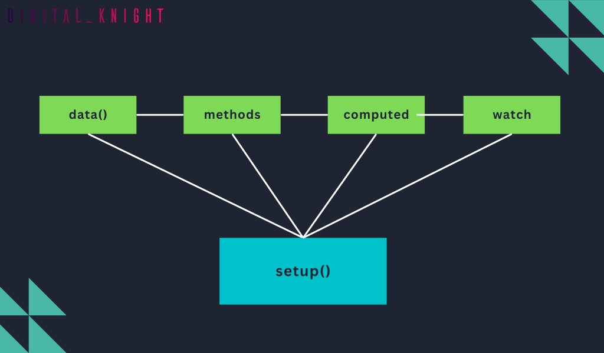

<h1 class='text-white mb-10 mt-5 text-2xl uppercase text-center'>
  Nowe, Lepsze compositionAPi
</h1>

<TextBoxMD>
  <p class='indent-6'>
    Wiemy że VUE wraz z wyjściem wersji "VUE3" wprowadził nowy alternatywny sposób pisania kodu, czyli CompositionAPI który daje nam inny sposób budowania naszych komponentów względem OptionsApi. Ma ona na celu poprawę skalowalności projektu oraz ułatwienie tworzenia reużywalnych komponentów.
    W skrócie, polega ona na definiowaniu funkcji, które następnie mogą być używane w komponencie. W przeciwieństwie do OptionAPI, CompositionAPI nie opiera się na jednym dużym obiekcie options, ale pozwala na tworzenie wielu mniejszych funkcji, które można następnie składać w większe komponenty. CompositionAPI ma kilka zalet, takich jak łatwiejsze testowanie, ułatwiony refaktoring i ponowne użycie kodu. Ponadto, CompositionAPI pozwala na lepsze wykorzystanie typowych wzorców programistycznych, takich jak np. useFetch, useLocalStorage, useTimer itp.
  </p>
  <p class='my-2'>
    <span class='text-green-500'>OptionAPI</span> (także znany jako Object-based API) to oryginalny sposób tworzenia komponentów w Vue. Polega on na definiowaniu właściwości komponentu w obiekcie options, który zawiera m.in. sekcję data, methods, computed itp. OptionAPI jest stosunkowo łatwy do zrozumienia i stosunkowo mało inwazyjny w stosunku do istniejącego kodu.
  </p>
  <p class='my-2'>
    Porównując OptionAPI i CompositionAPI, można zauważyć, że CompositionAPI jest bardziej elastyczne i pozwala na tworzenie bardziej modułowego i czytelnego kodu. Ponadto, CompositionAPI pozwala na lepsze rozdzielenie funkcjonalności, co ułatwia testowanie i ponowne użycie kodu. OptionAPI z kolei jest bardziej zrozumiały dla początkujących programistów i może być łatwiejszy do użycia w małych projektach. Trzeba też powiedzieć że OptionApi nadal działa w Vue3 i nadal jest aktualny dla wielu przypadków jednak przyszłością Vue jest CompositionApi
  </p>
  <p class='my-2'>
    Pamiętajmy jeszcze że w CompositionAPI możemy również skorzystać ze składni script setup która jeszcze bardziej ułatwia nam pracę. Ale to po kolei. Zerknijmy poniżej i zobaczy czy zauważysz różnice: 
  </p>
</TextBoxMD>

<div class='flex flex-wrap justify-center gap-x-3'>

```vue
<!-- OptionsAPI  -->

<template>
  <div>
    <h1>{{ message }}</h1>
  </div>
</template>

<script>
export default {
  data() {
    return {
      count: 0,
      msg: "option",
      text: 'api'
    }
  },
  methods: {
    increment() {
      this.count++
    }
  },
  computed: {
    message() {
      return this.msg.charAt(0).toUpperCase() 
           + this.msg.slice(1) 
           + this.text.toUpperCase() + ' !';
    }
  }
}
</script>

```

```vue
<!-- CompositionAPI -->

<template>
  <h1>{{ message }}</h1>
</template>

<script>
import { reactive, computed } from 'vue';
export default {
  setup() {
    const state = reactive({
      count: 0,
      msg: 'composition',
      text: 'api',
    });
    const increment = () => {
      state.count++;
    };
    const message = computed(() => {
      return state.msg.charAt(0).toUpperCase() 
           + state.msg.slice(1) 
           + state.text.toUpperCase() + ' !';
    });
    return {
      state,
      increment,
      message,
    };
  },
};
</script>

```
</div>

<TextBoxMD>
  <p class='mb-4'>
    Na pierwszy rzut oka *OptionsApi* wydaję się przyjemniejszy i bardziej poukładany ale uwierzcie mi jak sie dłużej się popracuje z CompositionAPI wtedy zaczyny dostrzegać się plusy. 
  </p>
  
  <p class='my-2'>
    A najważniejsze z nich to:
    <ol>
      <li class='mb-2'>1. Reużywalność kodu: Composition API zachęca do tworzenia kompozycji, które są funkcjami, które mogą być używane wielokrotnie w różnych komponentach. Dzięki temu można łatwo przenieść logikę i stan między komponentami, co prowadzi do bardziej modułowego kodu i ułatwia ponowne użycie.
      </li>
      <li class='mb-2'>2. Czytelność kodu: Composition API pozwala na logiczne grupowanie powiązanych funkcji, danych i ich efektów w jednym miejscu. Zamiast rozproszonego kodu w różnych sekcjach, wszystko jest zdefiniowane w jednym miejscu, co ułatwia zrozumienie i utrzymanie kodu.
      </li>
      <li class='mb-2'>3. Skalowalność: Composition API dobrze skaluje się w przypadku większych projektów, gdzie istnieje wiele funkcji i logika do zarządzania. Dzięki możliwości dzielenia kompozycji na mniejsze, bardziej zrozumiałe części, łatwiej jest zarządzać i rozwijać kod.</li>
      <li class='mb-2'>4. Typowanie: Składnia Composition API działa lepiej z narzędziami do statycznego typowania, takimi jak TypeScript. Dzięki temu można łatwiej wykrywać i unikać błędów typów w kodzie.</li>
    </ol>
  </p>

  
</TextBoxMD>

<TextBoxMD>
  <p class='mb-4'>
    Jak jeszcze nie zacząłeś zabawy z CompositionApi polecam zerknąć na plac zabaw i sobie popróbować koncepty które postaramy się po kolei przedstawić w naszym tutku. 
  </p>

  <div class='p-8 border rounded-lg border-green-500 text-green-500 text-center'>
  
  [Plac Zabaw VUE](https://play.vuejs.org/#eNp9kUFLwzAUx79KfJcqzA3ZbXQDlYF6UFHBSy6je+sy0yQkL7NQ+t19SVn1ILv1/X//l/7SdnDr3PQYERZQhsorRyIgRbeSRjXOehKd8LgTvdh524iCq4U00lTWBBJNqMUy8cviAbW24tN6vb0orqQpZ8NxfBAPhI3TG0KehCj3N6uuy8t9X854yqkyLpI4Xjd2i3opgbkERuVs3IYJUOBX71Q9PQRr2LpLuxIq2zil0b84UqwmYSEySWzDZt9POSMfcXLKqz1WX//kh9CmTMKrx4D+iBJGRhtfIw14/f6MLT+PkM2j5vYZ+IbB6pgch9pdNFvW/tPLto/52ytTf4R1S2jC6VJJNDX73JfA/+P+zNV/defTed6Tpof+B7x8phs=)

  </div>


  
</TextBoxMD>

