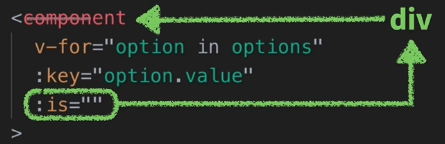
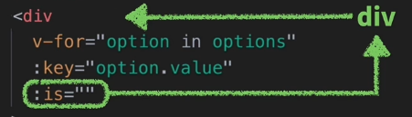

<h1 class='text-white mb-10 mt-5 text-2xl uppercase text-center'>
  Budujemy Formularz krok po kroku
</h1>

<TextBoxMD>
  <p class='indent-6'>
    W tym module postaramy się zbudować formularz krok po kroku, jednak będziemy go tworzyć z takich komponentów aby były reużywalne i stworzone według najlepszych praktyk. To co gotowy do walki 🐱‍👤.
  </p>
  <p class='my-2'>
    Warto zacząć od jakiegoś planu, co by nam się przydało do naszego formularza. Może zacznijmy od stworzenia jakiegoś ładnego inputa typu "text" a nastepnie będzie kombinować jak zrobić resztę czyli selecta, checkboxa oraz ratio. 
  </p>
  <p class='my-2 indent-6'>
    Stylami się narazie nie przejmujemy aby nie zaśmiecać ale udostępnie na końcu kod jak komuś się podoba styl. Oczywiście za style odpowiedzialny jest Pan Tailwind. To Bierzemy się za mięso. (przepraszam wszystkich vegan)
  </p>
</TextBoxMD>

<TextBoxMD>
  <h1 class="text-2xl uppercase font-semibold">
    <span class='text-green-500 forn-bold'>#</span>  Input typu tekst.
  </h1>
  <p>
    Najpierw stworzymy nowy komponent i ładnie go nazwiemy <span class='text-green-500'>"FormInput"</span> i wedle naszej koncepci "Atomic Design" wrzucimy go do naszych atomów.
  </p>
  <p class='my-2'>
    Bierzemy się za komponent. Zaczynamy od "labela". Najlepiej użyć tu interpolacji i poprzez propsa przekazać treść labelka od rodzica. Staje się on dzięki temu uniwersalny i będziemy mogli gu użyć w wielu różnych formularzach.
  </p>
</TextBoxMD>

```vue
// FormInput

<template>
    <label>
      {{ label }}
    </label>
    <input />
</template>

<script lang="ts">
import { defineComponent } from 'vue';

export default defineComponent ({
  name: 'FormInput',
  props: {
    label: {
      type: String,
      required: true
    }
  }

})
</script>
```
<BoxInfo class='mx-auto' title='TypeScript' description='Nie wiem czy miałeś wcześniej styczność z TypeScriptem we VUE. Dlatego żebyś nie nie przestraszył to odsyłam do Cię do części z TS a tutaj w kodzie dlatego że korzystamy z TypeScripta wystepuje defineComponent.' />

<TextBoxMD>
  <p class='indent-6'>
    Labelka mamy, czas na główne danie. Co zrobić aby nasz input był super mega uniwersalny.
    Możemy np: ustawić nasz palceholder aby był równy wartości labelka (tips).
    Nie ustawiamy również typu "type" dla naszego inputa dla naszego inpute ponieważ te wartość przekażemy już w rodzicu. Dzięki temu będziemy mogli wybrać między np: text, email czy password. 
  </p>
  <p class='my-2'>
    Nieźle za jednym zamacham mamy kilka opcji. 🧨
  </p>
  <p class='my-4'>
    V-model również możemy usunąć ponieważ na poziomie komponentu nie jest nam potrzebny. Uźyjemy go dopiero w rodzicu.
  </p>
  <p class='my-4'>
    No tak ale jak nie ma v-model to jak te dane pobrac lub zaktualizować ??? Jakbyśmy mieli w głównym komponencie to v-model byłby idealny ale tu skorzystamy z takiego rozwiązania. 
  </p>
  <p class='my-4'>
    W tym przykładzie wartość modelu jest przechowywana jako właściwość danych komponentu, którą nazywa się modelValue. Ta wartość będzie przekazana do elementu formularza (rodzica) jako wartość value.
  </p>
</TextBoxMD>

```vue
// FormInput

<template>
  <label>{{ label }}</label>
  <input 
    :placeholder='label'
    :value="modelValue"
  />
</template>

<script lang="ts">
import { defineComponent } from 'vue';

export default defineComponent ({
  name: 'FormInput',
  props: {
    label: {
      type: String,
      required: true
    },
    modelValue: {
      type: [String, Number],
      default: ''
    },
  }
})
</script>
```

<TextBoxMD>
  <p class='indent-6'>
    Jeśli użytkownik wprowadza zmiany w polu formularza, emitowane jest zdarzenie "input" za pomocą dyrektywy <span class='text-green-500'>@input</span>. Ta dyrektywa słucha zdarzeń wejściowych na elemencie formularza i wywołuje metodę $emit, która wysyła zdarzenie <span class='text-green-500'>update:modelValue</span> do rodzica komponentu, przekazując aktualną wartość pola formularza.
  </p>
  <p class='my-2'>
    @input="$emit('update:modelValue', $event.target.value)"
  </p>
</TextBoxMD>

```vue
// FormInput

<template>
<label>{{ label }}</label>
<input 
  :placeholder='label'
  :value="modelValue"
  @input="$emit('update:modelValue', $event.target.value)"
/>
</template>
```

<TextBoxMD>
  <p class='indent-6'>
    W rodzicu możemy zarejestrować to zdarzenie i aktualizować wartość model, używając v-model, który jest połaczeniem dla dyrektywy :value i @input ( więcej w module o v-model ). Jak juz mamy to wykonane to wrzucamy nasz komponet do naszego rodzica "FormData" który będzie naszym całym formularzem złożonym z komponetów i reszty elementów.
  </p>
</TextBoxMD>

```vue
// FormData

<template>
  <form>
    <h1>Formularz</h1>
    <FormInput 
      v-model="event.title"
      label="Super Label"
      type="text"
    />
  </form>
</template>

<script lang="ts">
export default defineComponent({
  name: 'FormData',
  components: {
    FormInput,
  },
  setup() {
    const event = {
        title: ''
    }

    return {
      event,
    }
  }
})
</script>
```

<TextBoxMD>
  <p>
    I tak się prezentuje na input. Wizualnie wygląda OK ale jak zerkniemy w DevToolse to możemy się dopatrzeć że wystąpił mały problemik. A jaki zapytasz. To zerknij i zauważysz że nie wyświetla się nam atrybut "type" mimo że dodaliśmy. O co tu chodzi???
  </p>
</TextBoxMD>

<div class='mx-auto w-96 mb-10'>
<h1>Formularz</h1>
<FormInput 
  label="Super Label"
  type="text"
  class='w-24'
/>
</div>


<TextBoxMD>
  <p class='indent-6'>
    W Vue za każdym razem, gdy przekazujesz atrybuty, klasy i style od rodzica do dziecka, tak jak robimy to z type w naszym FormInput, Vue spróbuje automatycznie dowiedzieć się, gdzie wewnątrz szablonu te atrybuty powinny zostać wstrzyknięte.
    W przypadku komponentów z pojedynczym elementem opakowującym, znanych również jako pojedyncze komponenty główne, takie zachowanie jest bardzo proste. Vue po prostu wstrzyknie wszystkie atrybuty, klasy i style do elementu głównego.
  </p>
  <p class='my-2'>
    W komponentach wielordzeniowych, takich jak nasz FormInput, Vue nie może ustalić bez naszej pomocy, do którego miejsca lub fragmentu powinien wstrzyknąć atrybuty — więc Vue po prostu się poddaje i powinno wyświetlić <span class='text-pink-500'>ostrzeżenie</span>.
  </p>
</TextBoxMD>

<div class='flex justify-center'>

```js
// Jest tylko jeden element input 
// więc nie ma problemu
// atrybuty spokojnie zostaną przekazane
<template>
  <input />
</template>
```
```js
// Są dwa elementy więc są i problemy
// Vue nie wie gdzie przekazać atrybut
<template>
  <label>Problem</label>
  <input />
</template>
```

</div>

<TextBoxMD>
  <p>
   W przypadku naszego FormInput aby mieć możliwość wstrzykiwania atrybutów bezpośrednio do pliku input, musimy ręcznie powiązać plik <span class='text-pink-500'>$attrs</span>. Zróbmy to teraz, dodając v-bind="$attrs” do naszego elementu wejściowego.
  </p>
</TextBoxMD>

```vue
// FormInput 

<template>
  <input 
    v-bind="$attrs"   // teraz VUE wie gdzie dodać atrybu do inputa
    :placeholder="label"
    :value="modelValue"
    @input="$emit('update:modelValue', $event.target.value)"
  >
</template>
```

<TextBoxMD>
  <p class='indent-6'>
   Dzięki tej małej zmianie, VUE wie gdzie co dodać i dziecko będzie miało możliwość poprawnego odbieranai atrybutu np: type lub zastosowane klasy. 
   Po tym wszystkim powinno wszystko ładnie grać.
  </p>
</TextBoxMD>

```vue
// FormInput (dziecko)

<template>
  <div class="kolorki i inne css-y">
    <label 
      v-if="label"
      class="tailwind">
      {{ label }}
    </label>
    <input 
      class="tailwind"
      v-bind="$attrs"
      :placeholder="placeholder?.length > 0 ? placeholder : label"
      :value="modelValue"
      @input="$emit('update:modelValue', $event.target.value)"
    >
  </div>
</template>


<script lang="ts">
import { defineComponent } from 'vue';

export default defineComponent ({
  name: 'FormInput',
  props: {
    label: {
      type: String,
      required: true
    },
    modelValue: {
      type: [String, Number],
      default: ''
    }
  }

})
</script>
</template>
```

```vue
// FormData (rodzic)

<template>
  <h1>Formularz</h1>
  <form>
    <FormInput 
      v-model="event.title"
      label="Label title"
      type="text"
    />
    <FormInput 
      v-model="event.description"
      label="Label desc"
      type="text"
    />
  </form>
</template>

<script lang="ts">
import { defineComponent } from 'vue'
import FormInput from '@/components/atoms/Form/FormInput/FormInput.vue'

export default defineComponent({
  name: 'FormsView',
  components: {
    FormInput,
  },
  setup() {
    const event = {
      title: '',
      description: '',
    }
    return {
      event
    }
  }
})
</script>
```

<div>
  <div class='mx-10 my-2 p-5 bg-gray-600 rounded-lg text-white'>
    <p>
      I proszę finalnie mamy dwa ładne inputy.
    </p>
  </div>
</div>

<Form class='w-96 mx-auto mb-10'>
  <h3 class='text-white font-semibold'>Formularz</h3> 
  <FormInput 
    label="Name"
    type="text"
  />
  <FormInput 
    label="Surname"
    type="text"
  />
</Form>

<TextBoxMD>
  <h1 class="text-2xl uppercase font-semibold">
    <span class='text-green-500 forn-bold'>#</span> FormSelect
  </h1>
  <p>
    To co jedziemy dalej. Czas na jakiegoś inputa typu selecta
  </p>
  <p class='my-2'>
    Z labelkiem będzie identycznie więc bierzemy się od razu za grubsze sprawy. Jak poprzednio aby nasz komponent był elastyczny musimy umożliwić rodzicowi jego modyfikowanie. Więc znów v-model dodamy dopiero w rodzicu a w komponencie dodamy modelValue czyli naszą domyślną nazwe właściwości, której VUE będzie szukać podczas wiązania v-model do niestandardowych komponentów. Ok czas start. Tworzymy "FormSelect" jako nowy komponent. 
  </p>
</TextBoxMD>

```vue
// FormSelect

<template>
    <label>{{ label }}</label>
    <select 
      :value="modelValue"
    >
      <option
        v-for="option in options"
        :value="option"
        :key="option"
        :selected="option === modelValue"
      >
        {{ option }}
      </option>
    </select>
</template>

<script lang="ts">
import { defineComponent } from 'vue';

export default defineComponent ({
  name: 'FormInput',
  props: {
    label: {
      type: String,
      required: true
    }
  }

})
</script>
```

<div class='mx-10 my-2 p-5 bg-gray-600 rounded-lg text-white'>
  <p>Zauważ, że tym razem nie używamy bezpośredniego powiązania, konfigurując nasz detektor zdarzeń zmiany za pomocą @changesłowo kluczowe, tak jak zrobiliśmy to w naszym BaseInputskładnik dla @inputwydarzenie. Tym razem konfigurujemy powiązanie naszego zdarzenia bezpośrednio z plikiem v-bindobiekt, po naszym $attrswiążący.

W Vue 3 ważne jest, aby pamiętać, że jeśli zdecydujemy się nie używać @składni znaku, zdarzenie zostanie poprzedzone słowem kluczowym on, w tym przypadku onChangeponieważ słuchałem changewydarzenie.

Wszystkie odbiorniki zdarzeń, które są odbierane w $attrsod rodzica poprzedzone są przedrostkiem onsłowo kluczowe, a pierwsza litera jest wielka.

Na naszym słuchaczu zdarzeń dla onChangechwytamy $eventjako parametr funkcji i $emitnasze wydarzenie update:modelValuez ładunkiem $event.target.valuepoinformowanie rodzica o wszelkich zmianach. </p>
  <p>
    I co dalej. Trzeba by wybrać jakąś opcję. 
  </p>
</div>

<div class='mx-10 my-2 p-5 mt-10 bg-gray-600 rounded-lg text-white'>
  <h1 class='text-2xl uppercase font-semibold'>Checkbox</h1> 
  <p>Kolej na checkboxa, który równie często wystepuje w formularzach. Z label już wiem jak sobie poradzić ale czy wiemy jak z v-model. Tutaj będzie troszkę inaczej ponieważ checkboxy mają kilka dziwactw! o których musimy pamiętać zanim zaczniemy ustawiać nasze wiązania. Pierwszym z nich jest to, że wejścia checkboxów wiążą swój stan z właściwością checked, a nie bezpośrednio z wartością 'value'
  </p>

  <p class='my-4'>
  Właściwość 'value' pól checkbox nie jest zwykle używana na frontendzie, ponieważ jej głównym celem jest dostarczenie wartości, gdy jest przekazywana do backendu poprzez przycisk submit. Jeśli pominiemy tę wartość, domyślnie ustawia się ona na on, co jest w porządku dla większości aplikacji - ponieważ większość formularzy będzie obsługiwana za pośrednictwem jakiegoś asynchronicznego postu, a przekazywane zmienne do backendu są kontrolowane przez kod frontendowy.
  </p>

  <p class="my-4">
  Drugą rzeczą, o której musimy pamiętać jest to, że wejścia typu checkbox nie wywołują zdarzeń wejściowych, ale zdarzenia zmiany, gdy są zaznaczone i odznaczone.
  </p>

  <p>
  Teraz, gdy jesteśmy uzbrojeni w tę wiedzę, dodajmy nasz prop modelValue, który będzie zawierał pierwszą część naszego dwukierunkowego wiązania: pozwalając rodzicowi na wstrzyknięcie stanu dla pola wyboru.
  </p>

  <p>
  Następnie przejdźmy do szablonu i zastąpmy wiązanie v-model, które zostało skopiowane z formularza demo wcześniej, naszym nowym wiązaniem :checked w naszym rekwizycie modelValue.
  </p>
</div>

```js
<template>
<div>
  <input
    type="checkbox"
    :checked="modelValue"
    class="field"
  />
  <label v-if="label" class="ml-2">{{ label }}</label>
</div>
</template>

<script lang="ts">
import { defineComponent } from 'vue';
export default defineComponent({
  name: 'FormCheckbox',
  props: {
    label: {
      type: String,
      default: ''
    },
      modelValue: {
      type: Boolean,
      default: false
  }
  }
})
</script>
```

<div class='mx-auto w-96 border border-green-500 p-6 rounded-lg'>
  <FormCheckbox label='Zaznacz mnie przyjacielu'/>
  <FormCheckbox label='I mnie też'/>
</div>

<div class='mx-10 my-2 p-5 mt-10 bg-gray-600 rounded-lg text-white'>

  <p class='my-4'>
  Na koniec, musimy emitować update:modelValue kiedy chcemy powiadomić rodzica, że pole wyboru zostało przełączone. Będziemy nasłuchiwać zdarzenia @change na elemencie wejściowym i emitować nowy, sprawdzony stan naszego elementu, gdy tylko zostanie ono wywołane.
  </p>

  <p>
Zauważ, że dla pól wyboru (checkbox) nie emitujemy wartości celu (target value) poprzez $event.target.value, ale zamiast tego status checked poprzez $event.target.checked.
  </p>

  <p>
  No to wrzućmy nasze checkboxy i połączmy z resztą zobaczymy jak to wygląda
  </p>
</div>

<Form class='w-96 mx-auto'>
  <h3 class='text-white font-semibold'>Przykładowe inputy</h3>
    
  <FormInput 
    label="Name"
    type="text"
  />
    
  <FormInput 
    label="Surname"
    type="text"
  />
  <FormCheckbox 
    label='Zaznacz'
  />
</Form>

<div class='mx-10 my-2 p-5 bg-gray-600 rounded-lg text-white'>
  <h1 class='text-2xl uppercase font-semibold'>Radio</h1> 
  <p>Ufff już bliżej końca. Zostało jeszcze radio</p>
  <p>
  Nadszedł czas, aby zająć się ostatnim z naszych elementów formularza Radio.

  Przyciski opcji w HTML mają unikalną cechę, o której musimy wiedzieć, zanim zaczniemy budować nasz komponent — nie działają one jako pojedyncze dane wejściowe, jak w przypadku pól wyboru(checkbox). Żyją i funkcjonują jako część grupy przycisków opcji, które mają jeden stan.

  W zależności od stanu grupy przycisk radiowy może być aktywny lub nieaktywny w stosunku do przycisków w swojej grupie.

  Z powodu tego szczególnego dziwactwa w sposobie działania przycisków opcji, FormRadio komponent będzie miał również inny komponent do ich pogrupowania, the FormRadioGroup. 
  </p>

  <p class='my-4'>
  Ok jedziemy. Labela nie ma co omawiać natomiast v-model już warto.
  Zauważ, że dla FormRadio ustaliliśmy rodzaj modelValue być z [String, Number]. To powie Vue, że ta właściwość może akceptować wartości łańcuchowe lub liczbowe. 
  </p>

  <p class='my-4'>
  Gdy mamy do czynienia z przyciskami radiowymi, każdy przycisk zawiera wartość (value), którą reprezentuje w zestawie. Na przykład, gdybyś miał grupę przycisków opcji do wyboru ulubionego zwierzaka, jeden przycisk opcji reprezentowałby doga inny by reprezentował cat czyli:
  Musi być używany w połączeniu z innymi przyciskami radiowymi, tak aby się wzajemnie wykluczały.

  Przyciski radiowe łączysz poprzez podobną wartość nazwy (name):

Często zdarza się, że te przyciski reprezentują również wartości liczbowe. Na przykład podczas wybierania liczby gości do pokoju hotelowego lub nawet wartości logicznych w ich formacie numerycznym. 
  </p>
</div>

```html
<label>
  <input type="radio" name="newsletter" value="yes">
  Yes
</label>
<label>
  <input type="radio" name="newsletter" value="no">
  No
</label>
//Zaważ że zaznaczenie jednego usuwa zaznaczenie drugiego
```
<div class='my-10'>
  <label>
  <input type="radio" name="newsletter" value="yes">
  Yes
</label>
<label>
  <input type="radio" name="newsletter" value="no">
  No
</label>
</div>


<div class='mx-10 my-2 p-5 bg-gray-600 rounded-lg text-white'>
  <p>
    Przejdźmy teraz do wiązania naszej właściwości modelValue z naszym elementem wejściowym. Podobnie jak pola wyboru, przyciski radiowe nie wiążą się z właściwością value, ale używają właściwości checked. Jednakże, w szczególnym przypadku przycisków radiowych musimy sprawdzić, czy ten przycisk jest tym, który jest aktualnie wybrany, czy nie.

    Wróćmy do naszego ulubionego przykładu ze zwierzątkami. ModelValue naszych elementów BaseRadio będzie zawierał preferencje użytkownika, a więc albo kota albo psa - ale musimy być w stanie powiedzieć temu radiu, którą z tych wartości reprezentuje.

    Aby to zrobić, dodamy do komponentu nowy rekwizyt(prop) - value.
  </p>

  <p class='my-4'>
    Zauważ, że nie ustawiliśmy wartości domyślnej w przypadku wartości prop, ale zamiast tego wybraliśmy ustawienie właściwości na wymaganą. Jeśli ta właściwość nie jest ustawiona, Vue wyda dla nas ostrzeżenie.

Przycisk radiowy po prostu nie ma sensu, gdy nie ma do niego przypisanej wartości, a wartość domyślna może być potencjalnie problematyczna, jeśli użytkownik zapomni ją ustawić i wiele radioodbiorników będzie miało tę samą wartość.

Aby wiedzieć, czy nasze radio jest :checked, będziemy patrzeć, czy modelValue jest równy wartości. Oznacza to, że preferencje użytkownika, na przykład "pies", będą albo równe wartości tego radia, albo nie będą - zaznaczone lub odznaczone.

Przejdźmy więc dalej i usuńmy stare wiązanie v-model oraz twardo zakodowany atrybut name i zastąpmy go naszym wiązaniem checked. Upewnimy się również, że zaktualizujemy wiązanie wartości do naszego nowego rekwizytu.

Przetłumaczono z www.DeepL.com/Translator (wersja darmowa)
  </p>

  <p class='my-4'>
    Już prawie! Teraz musimy dodać drugą część naszego kontraktu v-model, emitowanie zdarzeń aktualizacji. Przyciski radiowe wyzwalają zdarzenia zmiany, gdy stają się wybraną opcją, więc ustawmy słuchacza zdarzeń(listeneraa) zmiany z naszym update:modelValue emit.
  </p>

  <p class='my-4'>
    Zwróć uwagę na ładunek naszego $emit. Zamierzamy emitować prop wartości. Chcemy, aby nasz odbiorca v-modelu na rodzicu przechowywał wartość aktualnie wybranego przycisku radiowego, a ponieważ zdarzenie change będzie wywoływane tylko wtedy, gdy element dokona wybranego wyboru, możemy bezpiecznie odpalić value, aby zaktualizować rodzica o nowo wybraną opcję.

Na koniec, ponieważ usunęliśmy atrybut name, musimy upewnić się, że programista używający tego komponentu jest w stanie ustawić atrybuty takie jak name w naszym input. Tak więc użyjemy v-bind="$attrs" na naszym input, tak jak nauczyliśmy się tego podczas budowania naszego komponentu BaseInput, aby umożliwić wstrzyknięcie tego atrybutu do właściwego elementu.
  </p>

</div>


```js
<template>
  <input
      type="radio"
      :checked="modelValue === value"
      :value="value"
      @change="$emit('update:modelValue, value')"
      v-bind="$attrs"
    />
  <label v-if="label">{{ label }}</label>
</template>

<script lang="ts">
import { defineComponent } from 'vue';

export default defineComponent({
  name: 'FormRadio',
  props: {
    label: {
      type: String,
      default: ''
    },
    modelValue: {
      type: [String, Number],
      default: ''
    },
    value: {
      type: [String, Number],
      required: true
    }
  }
})
</script>

```

<FormRadio label='kotek'/>

<div class='mx-10 my-2 p-5 bg-gray-600 rounded-lg text-white'>
  <p>
    Teraz, gdy nasz komponent jest gotowy, możemy wrócić do naszego SimpleForm.vue i zastąpić dwa pola wyboru naszym nowym, błyszczącym komponentem BaseRadio!
  </p>
</div>

```html
<h3>Można wziąć zwierzaczka ?</h3>
<div>
  <FormRadio 
    label="Tak"
    v-model="event.pets"
    :value="1"
    name="pets"
  />
  <FormRadio 
    label="Nie"
    v-model="event.pets"
    :value="0"
    name="pets"
  />
</div>
```

<h3>Można wziąć zwierzaczka ?</h3>
<div>
  <FormRadio 
    label="Tak"
    :value="1"
    name="pets"
  />
  <FormRadio 
    label="Nie"
    :value="0"
    name="pets"
  />
</div>


<div class='mx-10 my-2 mt-10 p-5 bg-gray-600 rounded-lg text-white'>
  <h1 class='text-2xl uppercase font-semibold'>RadioGroup</h1> 
  <p>Jak widzieliśmy, przyciski radiowe mają kilka dziwactw, które mogą potencjalnie uczynić je mylącymi i trudnymi do pracy, ale zrobiliśmy duży postęp w tworzeniu solidnego komponentu BaseRadio. W naszej następnej lekcji pójdziemy o krok dalej i stworzymy komponent BaseRadioGroup, który pozwoli nam jeszcze bardziej uprościć konfigurację i tworzenie grup przycisków radiowych.
  </p>

  <p class='my-4'>
  W naszej ostatniej lekcji stworzyliśmy nasz ostatni komponent formularza bazowego dla tego kursu, BaseRadio.

Jednak zostawiliśmy komponent, który jest całkowicie elastyczny i wielokrotnego użytku, ale czasami trochę trudny do zrozumienia. Dla kogoś, kto nie jest zaznajomiony z wewnętrznym działaniem BaseRadio, grupa wszystkich wskazujących na ten sam stan v-modelu może być myląca. Mogą również wystąpić błędy, jeśli ktoś zapomni dodać atrybut nazwy do pewnej części grupy.

Byłoby lepiej, gdybyśmy mieli komponent opakowujący, który obsługiwał całą logikę zarządzania połączeniami v-model dla naszego użytkownika, dzięki czemu muszą pamiętać, aby zrobić to tylko raz - jak w większości innych, i jest łatwiejszy do zrozumienia na pierwszy rzut oka.

Wejdź do BaseRadioGroup!
  </p>

  <p class='my-4'>
    Jak wspomnieliśmy w ostatniej lekcji, tak naprawdę nie ma sensu, gdy przyciski radiowe są same w sobie, ponieważ nie zapewniają użytkownikowi wyboru, co jest kluczową cechą przycisków radiowych. Więc prawie zawsze chcesz zapewnić co najmniej dwa radia na każdą grupę, chyba że robisz coś takiego.
    <BoxInfo 
      title="Lepiej grupowe bo jeden radio grze uzyjesz"
      description='trzeba grupować żeby nie narobić bałąganu'
    />
  </p>
</div>

<div class='mx-10 my-2 mt-10 p-5 bg-gray-600 rounded-lg text-white'>
  <p class='my-4'>
    Aby rozpocząć, musimy utworzyć rekwizyt, który pozwoli użytkownikowi tego komponentu przekazać tablicę opcji, spośród których użytkownik chce wybrać. Chcemy również mieć pewność, że wykorzystujemy dane zawarte w tym nowym optionsprop, aby przejrzeć obiekty zawierające i utworzyć nowy BaseRadioinstancja komponentu dla każdego z nich.

    The options właściwość będzie tablicą obiektów i będziemy chcieli, aby każdy z obiektów w środku zawierał co najmniej dwie właściwości: the labeli value. Na przykład:  
  </p>
</div>

```js
const radioOptions = [
  { label: 'Gud boi', value: 'dog' },
  { label: 'Angri boi', value: 'cat' }
]
```

<div class='mx-10 my-2 mt-10 p-5 bg-gray-600 rounded-lg text-white'>
  <p class='my-4'>
    Następnie użyjemy naszego labelka każda z naszych wytwórni radiowych i valuejako wartość każdego radia.  
  </p>
</div>


<div class='mx-10 my-2 mt-10 p-5 bg-gray-600 rounded-lg text-white'>
  <p class='my-4'>
    Zauważ, że deklarujemy options prop zgodnie z wymaganiami, ponieważ ten komponent po prostu nie będzie działał bez niego.

Jak dowiedzieliśmy się na ostatniej lekcji, wszystkie grupy radio są połączone razem jako grupa przez name property.

Wszystkie radio w grupie muszą mieć to samo name aby przeglądarka wiedziała, że ​​powinny być zgrupowane.

Więc przejdźmy dalej i dodajmy nasz drugi rekwizyt, the name prop i upewnij się, że jest poprawnie powiązany z naszym FormRadio.  
  </p>
</div>

```js
<template>
  <FormRadio
    v-for="option in options"
    :key="option.value"
    :label="option.label"
    :value="option.value"
  >
  </FormRadio>
</template>

<script lang="ts">
import { defineComponent } from 'vue';
import FormRadio from '../FormRadio/FormRadio.vue';

export default defineComponent({
  name: 'FormRadioGroup',
  components: {
    FormRadio
  },
  props: {
    options: {
      type: Array,
      required: true
    },
    name: {
      type: String,
      required: true
    }
  }

})
</script>
```

<div class='mx-10 my-2 mt-10 p-5 bg-gray-600 rounded-lg text-white'>
  <p class='my-4'>
    Jeszcze raz deklarujemy nasz rekwizyt jako required, ponieważ bez atrybutu nazwy wejścia radiowe nie zostaną poprawnie zgrupowane. 
  </p>
</div>

<div class='mx-10 my-2 mt-10 p-5 bg-gray-600 rounded-lg text-white'>
  <p class='my-4'>
    Czas na v-model. Teraz, gdy poprawnie przechodzimy przez nasze komponenty radiowe, prawdopodobnie wiesz, co będzie dalej po zbudowaniu wielu tych komponentów formularza podstawowego. Nadszedł czas, aby umożliwić obsługę tego komponentu v-modelwiązanie dwukierunkowe. Jak zwykle dodamy modelValue prop. 
  </p>
</div>

<div class='mx-10 my-2 mt-10 p-5 bg-gray-600 rounded-lg text-white'>
  <p class='my-4'>
    Tym razem zrobimy rekwizyt required, ponieważ grupy radiowe bez zaznaczenia niczego nie mają większego sensu; tak naprawdę nie ma stanu „nic nie wybrano” podczas korzystania z tego typu danych wejściowych formularza.

Nie zapomnij również związać modelValue props dla każdego FormRadio w pętli!

Następnie zacznijmy słuchać update:modelValue zdarzenie każdego z FormRadio i wyemitować je z powrotem do rodzica FormRadioGroup.  
  </p>
</div>

```js 
  <FormRadio
    v-for="option in options"
    :key="option.value"
    :label="option.label"
    :value="option.value"
    :modelValue="modelValue"
    :name="name"
    @update:modelValue="$emit('update:modelValue', $event)"
  >
  </FormRadio>
```

<div class='mx-10 my-2 mt-10 p-5 bg-gray-600 rounded-lg text-white'>
  <p class='my-4'>
    Wróćmy teraz do naszego SimpleForm.vue  i zastąp „Czy zwierzęta są akceptowane?” Sekcja FormRadio nowym FormRadioGroup. Zerknij teraz na nasz formularz na samym dole I jak? 
  </p>
</div>

```
<FormRadioGroup
    v-model="event.pets"
    name="pets"
    :options="petOptions"
/>

```

<div class='mx-10 my-2 mt-10 p-5 bg-gray-600 rounded-lg text-white'>
  <p class='my-4'>
    Nie da się ukryć że coś trzeba poprawić. Może dajmy wybór urzytkownikowi czy chce aby nasze radio były ustawione w pionie jak i poziomie. 
  </p>

  <p class='my-4'>
  Aby korzystanie z niego było jak najprostsze, wszystkie te przełączania będą kontrolowane przez jeden nowy props, vertical. Ustawimy domyślny układ radio w naszym FormRadioGroup poziomego, więc ten rekwizyt będzie typu boolowskiego i domyślnie false. 
  </p>

  <p class='my-4'>
  Jest to bardzo powszechna praktyka podczas tworzenia komponentów w celu ustawiania rekwizytów, które mają włączać i wyłączać (znanych również jako „flagi”) na wartość domyślną false. To pozwala nam ustawić je na „włączone” z bardzo czystą składnią instancji komponentu. Na przykład z naszym verticalprop, jeśli użytkownik chce, aby jego grupa była ułożona pionowo, po prostu dodałby słowo kluczowe do instancji w następujący sposób: 
  </p>
</div>

```html
<FormRadioGroup
  v-model="event.pets"
  vertical
/>
```

<div class='mx-10 my-2 mt-10 p-5 bg-gray-600 rounded-lg text-white'>
  <p class='my-4'>
   Zakłada się, że rekwizyty boolowskie w Vue, które nie są specjalnie powiązane, są prawdziwe . Więc w powyższym przykładzie verticaljest taki sam jak :vertical="true".

  Wróćmy do FormRadioGroup.vue dodaj nasz verticalprop i rozpocznij konfigurowanie tej nowej funkcji. 
  </p>
</div>

```js
<script>
export default {
  props: {
    options: {
      type: Array,
      required: true
    },
    name: {
      type: String,
      required: true
    },
    modelValue: {
      type: [String, Number],
      required: true
    },
    vertical: {
      type: Boolean,
      default: false
    }
  }
}
</script>
```

<div class='mx-10 my-2 mt-10 p-5 bg-gray-600 rounded-lg text-white'>
  <p class='my-4'>
   Teraz, aby skorzystać z naszego propa  vertical  , który musimy zapakować FormRadioGroup we własnym komponencie. Gdy radio są ustawione pionowo, chcemy, aby było to a div, a gdy są poziome, użyjemy a span.

  Istnieje oczywiście wiele sposobów rozwiązania tego konkretnego problemu, ale w szczególności to rozwiązanie pozwala mi pokazać, jak wykorzystać moc component :is dla Twoich dynamicznych komponentów formularzy! Zaczniemy od zapakowania wszystkiego w ok component element i przesuwanie v-for zapętlić się na nim.

   (Nie zapomnij zabrać ze sobą również tzw :keywiążąca wraz z v-for)

Teraz musimy określić logikę dla iswłasność r componentczęść. Bez względu na to, do którego ciągu znaków przekażemy, Vue użyje go podczas renderowania komponentu. Jeśli więc ustawimy isnieruchomość do div, ten komponent opakowujący będzie elementem div, a jeśli ustawimy go na span, będzie to oczywiście rozpiętość. 
  </p>
</div>

```vue
<template>
  <component
    v-for="option in options"
    :key="option.value"
    :is="vertical ? 'div' : 'span'"
    :class="{
      horizontal: !vertical
    }"
  >
    <FormRadio
      :label="option.label"
      :value="option.value"
      :modelValue="modelValue"
      :name="name"
      @update:modelValue="$emit('update:modelValue', $event)"
    />
  </component>
</template>
```


<div class='flex'>
  
  
</div>

<div class='mx-10 my-2 mt-10 p-5 bg-gray-600 rounded-lg text-white'>
  <p class='my-4'>
    Ponieważ nie jest to bardzo skomplikowana logika, możemy sobie pozwolić na pozostawienie wszystkiego w szablonie. Tutaj sprawdzamy, czy verticalprop jest truey , to ustawiamy a divjeśli nie spantak jak ustaliliśmy jakiś czas temu.

    Zauważ, że oba 'div'oraz 'span'są ujęte w pojedyncze cudzysłowy, ponieważ muszą to być łańcuchy znaków.

    Jeśli ustawimy verticalflaga dla nas BaseRadioGroupteraz włączone SimpleForm.vuei sprawdź to w przeglądarce, wszystko wydaje się działać zgodnie z oczekiwaniami. 
  </p>
  <p class='my-4'>
  Jest jednak jeszcze jedna regulacja, którą musimy wprowadzić w układzie poziomym. Musimy dodać trochę stylizacji, aby nieco oddzielić elementy.

Dodajmy A horizontalcss i zastosuj ją, gdy element używa układu poziomego. Lub w kategoriach kodu, gdy nie jest to pionowe. 
  </p>
</div>

```vue 
<template>
  <component
    v-for="option in options"
    :key="option.value"
    :is="vertical ? 'div' : 'span'"
    :class="{
      horizontal: !vertical
    }"
  >
    <BaseRadio
      :label="option.label"
      :value="option.value"
      :modelValue="modelValue"
      :name="name"
      @update:modelValue="$emit('update:modelValue', $event)"
    />
  </component>
</template>

<script>
[...]
</script>

<style scoped>
.horizontal {
  margin-right: 20px;
}
</style>
```

<div class='mx-10 my-2 mt-10 p-5 bg-gray-600 rounded-lg text-white'>
  <p class='my-4'>
    W środku componenttag, ustawiamy nowy classwiązanie i używanie składni obiektu do włączania i wyłączania klas.

  Kiedykolwiek warunek !verticalocenia na true- więc kiedy pion jest false, będziemy chcieli zastosować nasze horizontalklasa CSS.

  Usuńmy verticalflaga z naszego BaseRadioGroupod SimpleForm.vuea następnie jeszcze raz sprawdź przeglądarkę.  
  </p>
  <p class='my-4'>
  Wraz z ukończeniem naszej BaseRadioGroupcomponent kończymy tworzenie naszych komponentów formularza bazowego. Świetna robota, aby przejść przez to wszystko!

  W następnej lekcji zrobimy mały krok i przyjrzymy się, jak możemy prawidłowo obsługiwać przesyłanie formularzy w Vue, wykorzystując moc powszechnie używanej biblioteki do wysyłania żądań HTTP: Axios. 
  </p>
</div>


