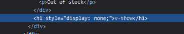

<h1 class='text-white mb-10 mt-5 text-2xl uppercase text-center'>
  Conditional Rendering
</h1>

- [1. Conditional rendering](#1-options)

<TextBoxMD>
  <h1 class="text-2xl font-semibold">
    <span class='text-green-500 forn-bold'>#</span>  Conditional Rendering  - Renderowanie warunkowe.
  </h1>
  <p class='my-2'>
    A teraz bardzo fajne i przyjemne renderowanie warunkowe za pomocą dyrektywy "v-if", "v-else", "v-else-if" oraz "v-show". Ogólnie pracy z if czy else nie trzeba nikomu tłumaczyć. W prostych żołnierskich słowach: "Te dyrektywy pozwalają na wyświetlenie różnych elementów w zależnosći od spełnionych warunków."
  </p>
  <p class='my-2'>
     Można również użyć atrybutu "v-show" do dynamicznego ukrywania i pokazywania elementów, ale v-if i v-show mają różnice w działaniu, co warto wiedzieć ale zaraz pokażemy i omówimy sobie wszystko na przykładach.
  </p>
  <p class='my-2'>
    To zaczynamy, zerknijmy na przykład poniżej:
  </p>
</TextBoxMD>

<div class='flex justify-center flex-wrap'>

```vue
<!-- CompositionApi -->

<template>
  <div>
    <p v-if="showMessage">To jest wyświetlana wiadomość.</p>
    <p v-else>To jest wiadomość alternatywna.</p>
  </div>
</template>

<script>
import { ref } from 'vue';

export default {
  setup() {
    const showMessage = ref(true);

    return {
      showMessage,
    };
  },
};
</script>

```
```vue
<!-- CompositionApi - script setup -->

<template>
  <div>
    <p v-if="showMessage">To jest wyświetlana wiadomość.</p>
    <p v-else>To jest wiadomość alternatywna.</p>
  </div>
</template>

<script setup>
import { ref } from 'vue';

const showMessage = ref(true);

</script>

```

</div>

<IfExampleOne />

<TextBoxMD>
  <p class='my-2'>
    I jak, nie wygląda to strasznie. W zależności jaką otrzymamy wartość taką dostaniemy widomość. Kliknij sobie powyżej i zmień wartość boolean a zobaczysz jak komponent wyrenderuje nam alternatywną wiadomość. 
  </p>
  <p class='my-2'>
    Wykorzystać to możemy na naprawdę wiele sposobów. Choćby mamy sklep i kończą nam się produkty na magazynie to możemy ustawić że poniżej danej liczby produktów pokaż wiadomość "Kończą się zapasy. Śpiesz się!", a jak już się skończą to jeszcze inną. Albo kochana aplikacja przez wszystkich deweloperów TODO lista. Jak nie mamy zadać to wyświetlimy wiadomość że nie mamy aktualnie nic do zrobiena a jak są to wtedy wyświetla nam się lista zadań. Fajnie nie. 
  </p>
  <p>
    To teraz wykonajmy jeszcze coś z v-if-else.
  </p>
</TextBoxMD>

```vue 
<script setup>
import { ref } from 'vue'

const condition = ref('Świerzak');
</script>

<template>
  <div>
    <p v-if="condition === 'SuperUser'">Jesteś SuperUserem</p>
    <p v-else-if="condition === 'ZwykłyUser'">Jesteś zwykłym użytkownikiem</p>
    <p v-else-if="condition === 'Świerzak'">Jesteś Świerzakiem</p>
    <p v-else>Nie masz jeszcze statusu.</p>
  </div>
</template>
```

<TextBoxMD>
  <p class='my-2'>
    Powyższy przykład pokazuje nam bardziej rozbudowaną wersję już z użyciem v-if-else. I zależnie jaka wartość nam przyjdzie np: z serwera taki wyswietli się status użytkownika.  
  </p>
</TextBoxMD>

<TextBoxMD>
  <h1 class="text-2xl font-semibold">
    <span class='text-green-500 forn-bold'>#</span>  v-show
  </h1>
  <p class='my-2'>
    Zanim przejdziemy do kolejnych przykładów chciałbym ci jeszcze przybliżyć jeszcze jedną możliwość warunkowego renderowania jaką jest v-show bo tak naprawdę we Vue mamy dwie możliwość. Ale po co nam dwie możliwość zapytasz. To już pokazujemy różnicę między v-if ponieważ na pierwszy rzut oka te dyrektywy wyglądają podobnie jednak wystepują między nimi małe różnice.
  </p>
  <p class='my-2'>
    Róznica polega nam tym że v-show zawsze się wyrenderuje i będzie w naszym DOM. v-show przełącza tylko właściwość CSS "display" naszego elementu. Widać to bardzo dobrze w devToolsach.
  </p>

  

  <p class='my-2'>
    Trzeba też pamiętać że z v-show nieobsługuje naszego template anie wzspółdziała z nim v-else
  </p>
  <p class='my-2'> 
    Podsumowując v-if jest tak naprawdę takim naszym prawdziwym renderowaniem warunkowym, ponieważ te komponenty w naszym bloku warunkowym zostaną odpowiednio zniszczone i ponownie utworzone podczas przełączania. v-if też działa leniwie. Czyli jeżeli nasz warunek jest fałszywy podczas pierwszego renderowania to wtedy nic się nie wydarzy. Nasz blok nie zostanie wyrenderowany do tego momentu aż warunek nie stanie się prawdziwy po raz pierwszy dlatego też v-if ma większe koszty przełączania między blokami warunkowymi kody natomiast v-show ma wyższe koszty renderu bloku tylko podczas pierwszego renderowania. 
  </p>
  <p class='my-2'>
    Dlatego czasami warto na już na etapie tworzenia komponentu się chwilkę zastanowić czy nasz blok będzie wielokrotnie przełączany wtedy warto wtkorzystać v-show czy np. coś się wyświetli raz w zależności od przychodzącej informacji i nasz warunek raczej w czasie się nie będzie zbyt często zmieniał wtedy warto skorzystać z v-if.
  </p>

</TextBoxMD>


<TextBoxMD>
  <h1 class="text-2xl font-semibold">
    <span class='text-green-500 forn-bold'>#</span>  Przykłady
  </h1>
  <p class='my-2'>
    Teraz stworzymy sobie komponent który wyświetli nam widomość w zależności o stanów magazynowych danego produktu a następnie przeanalizujemy nasz kod. Let's go.
  </p>
</TextBoxMD>

<IfExampleTwo />

```vue
<script setup lang="ts">
import { reactive } from 'vue'

const fireSword = reactive({
  name: 'Miecz ognia',
  inventory: 0,
})
</script>

<template>
    <div>
      
        <div>
          <h1> {{ fireSword.name }}</h1>
          <p v-if="fireSword.inventory > 5"> 
            Duża dostępność
          </p>
          <p v-else-if="fireSword.inventory <=5 && fireSword.inventory > 0">
           Mała dostepność 
          </p>
          <p v-else> Niedostępnę </p>
          <span>{{ fireSword.inventory }}</span>
        </div>
      <button :disabled="fireSword.inventory < 1">
        Kup
      </button>
    </div>
</template>

```

<TextBoxMD>
  <p class='my-2'>
    Analizując powyższy przykład możemy zauważyć że w zależności jakie dane dostaniemy takie wyświetlą nam się informacje lub będziemy mogli wpływać na nasz komponent np: działanie przycisku.
  </p>
  <p>
    Od razu widać że w zależności od ilości posiadanych mieczy możemy wyświetlić inną informację dla użytkownika oraz przy braku produktu np: zablokować przycisk aby dodanie produkty do koszyka było niemożliwe lub przyciemnić produktu, możliwości jest wiele ogranicza nas tylko wyobraźnia i oczywiście dobre UX. 
  </p>
</TextBoxMD>