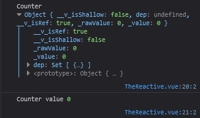

<h1 class='text-white mb-10 mt-5 text-2xl uppercase text-center'>
  Reaktywne dane
</h1>

- [1. Reaktywne Dane](#1-options)
- [1. OptionsAPI](#1-options) 
- [2. CompositionAPI](#2-composition)

<TextBoxMD>
  <h1 class="text-2xl font-semibold">
    <span class='text-green-500 forn-bold'>#</span>  Reaktywne dane. Jak mamy to rozumieć ?
  </h1>
  <p class='my-2'>
    Reaktywne dane stanowią kluczowy koncept we VUE. Pozwalają one na automatyczną aktualizację danych w komponencie bez potrzeby ręcznego manipulowania nimi. Czyli w dużym uproszczeniu VUE "obserwuje" nasze zmienne i w razie konieczności reaguje na ich zmianny.
  </p>
  <p>
    To co starczy teorii. Najlepiej jak popracujemy na przykładach. To w ramach przypomnienia (bo głównie skupiamy się na CompositionAPI) zerkniemy jak to się odbywało w wersji starszej niż VUE3 czyli naszym OptionsAPI.<br>
    W OptionsAPI do deklarowania stanu reaktywnego dodajemy właściwość `data` (data properties) do obiektu naszego komponentu. Od teraz nasze dane w 'data' są reaktywne i zmiana ich spowoduje ponowne renderowanie komponentu.
  </p>
</TextBoxMD>

```js
// OptionsAPI

export default {
  data() {
    return {
      counter: 0,
      name: 'John',
    };
  },
};
```

<TextBoxMD>
  <p>
    Jak można zauważyć W powyższym przykładzie "counter" oraz "name" zadeklarowane w 'data' są teraz reaktywne. Kiedy następuje zmiana wartości któregoś z tych pól, Vue automatycznie odświeży komponent, aby odzwierciedlić nową wartość.
  </p>
  <p>
    Aby uzyskać dostęp do danych reaktywnych wewnątrz komponentu w OptionAPI, musimy odwoływać się do nich za pomocą składnika "this". Na przykład, aby uzyskać dostęp do counter wewnątrz metody, możemy napisać:
  </p>
</TextBoxMD>

```vue
<template>
  <button @click="increment">Count is: {{ count }}</button>
</template>

export default {
  data() {
    return {
      counter: 0,
      name: 'John'
    };
  },
  methods: {
    increment() {
      this.counter++;
    }
  },
};
```

<TheCounter/>

<TextBoxMD>
  <p>
    W powyższym przykładzie, metoda increment zwiększa wartość counter o 1, a zmiana tej wartości spowoduje ponowne renderowanie komponentu. <br>
    Jednakże trzeba pamiętać że Options API, trzeba ręcznie zarządzać cyklem życia komponentu (hooks) i obserwacją zmian danych (watch). 
  </p>
</TextBoxMD>

<TextBoxMD>
  <h1 class="text-2xl font-semibold mb-6">
    <span class='text-green-500 forn-bold'>#</span>  CompositionAPI
  </h1>
  <p>
    To małe wprowadzenie i powtórkę OptionsApi mamy za sobą. Czas skupić się na tym co jest na topie i zalecane przez producenta czyt. "Evan You i VUE" nawet się zrymowało. Jak juz wczesniej zostało wspomniane w CompositionAPI dane reaktywne tworzy się trochę inaczej i możemy skorzystać z różnych podejść ale żeby nie było mamy tez możliwość tworzenia danych które nie są reaktywne (non-reactive) ponieważ nie zawsze potrzebujemy coś robić z naszymi danymi a po co dodawać naszej aplikacji kolejne zadania do wykonania. 
  </p>
  <p class='my-2'>
    We VUE3 CompositionAPI aby nasze dane aby były reaktywne i mutowalne korzystamy z funkcji dostarczanych przez Composition API, takich jak <span class='font-semibold text-pink-500'>"ref"</span> oraz <span class='font-semibold text-pink-500'>"reactive"</span><br>
  </p>
  
  <p>
    Przyjeło się że "ref" używamy raczej do tworzenia prostych typów danych, natomiast reactive służy do tworzenia obiektów dla bardziej złożonych struktur.<br>
    I tak jak to w reaktywnych danych wszelkie zmiany dokonane na naszych danych są automatycznie śledzone, co pozwala na natychmiastowe odzwierciedlanie tych zmian w interfejsie użytkownika.
  </p>
  <p class='my-2'>
    To jedziemy z przykładami bo tam będzie mi łatwiej przedstawić kilka niuansów. Zacznijmy od "ref"<br>
    W CompositionAPI aby skorzystać z refa oraz reactive musimy je zaimportować 
  </p>
</TextBoxMD>

<div class='flex justify-center flex-wrap'>

```vue
<!-- bez danych reaktywnych -->

<script setup>
let counter = 12

const increment = () => {
  counter++
}
</script>

<template>
  <h1>Counter</h1>
  <p> {{ counter }}</p>
  <button @click="increment()"> +1 </button>
</template>
```

```vue
<!-- dane reaktywne -->

<script setup>
import { ref } from 'vue'

const counter = ref(12)

const increment = () => {
  counter.value++
}
</script>

<template>
  <h1>Counter</h1>
  <p> {{ counter }}</p>
  <button @click="increment()"> +1 </button>
</template>
```

</div>

<TheReactive></TheReactive>

<TextBoxMD>
  <p>
    Analizujemy powyższy kod: <br>
    1. Na pierwszym przykładzie zauważymy że pomimo zadeklarowania zmiennej let couter i dodania funkcji increment tak naprawdę nic sie nie stanie. Nasz button nie będzie reagował dlatego że VUE nie obserwuje naszej zmiennej i pomimo akcji na przycisku nie nastapi ponowne renderowanie komponentu. <br>
    2. Drugi przykład już ładnie nam będzie działał ponieważ poprzez "ref" nasza zmienna zrobiła się reaktywna i teraz VUE będzie wiedział że każde działanie na naszej zmiennej ma spowodować zakualizowanie komponentu.<br>
    <span class='text-green-500'>poklikaj na +1 oraz -1</span><br>
    3. Jednak jak dobrze się przypatrzymy coś zmieniło się w naszej funckji increment. Tak dokładnie teraz aby odwołać się do nasze funkcji musimy to zrobić poprzez dodanie słowa kluczowego value a dlaczego? Już ci pokazuje na zdjęciu poniżej
  </p>
</TextBoxMD>



<TextBoxMD>
  <p>
    W devToolsach widać jak na dłoni co ref zrobił z naszą zmienną. Zamienił ją w obiekt. I żeby dostać się do wartości value w obiekcie musimy zapisać to jak couter.value. Pięknie. <br>
  </p>
</TextBoxMD>

<BoxInfo class='mx-auto' title='Ciekawostka z const i let.' description='Czy w przykładzie nie nurtowało cię że nasza zmienna counter mimo że jest const to się zmieniała. Dokładnie jeżeli korzystamy z ref nie musimy korzystać z let, ponieważ ref zmienia naszą zmienną w obiekt a w obiektach możemy modyfikować referecję. To taka mała powtóreczka z JS. '/>

<TextBoxMD>
  <p>
    To czas popracować trochę z naszą funkcją reactive. Przykład poniżej. <br>
  </p>
</TextBoxMD>

```vue
<script setup>
import { reactive } from 'vue'

const state = reactive({
  counter: 12,
  text: 'Witam',
  product: ['Gruszka', 'Orzeszki']
})

</script>

<template>
  <h1>{{ state.text }}</h1>
  <p>{{ state.counter }}</p>

  <input v-model="state.text">
</template>
```

<TextBoxMD>
  <p>
    To przeanalizujemy nasz kod. W tym przypadku importujemy naszą funkcję reactive. <br>
    2. Tworzymy naszą zmienną state (nazwa dowolna) i w przeciwieństwie do refa w reactive musimy zawsze zwrócić obiekt. 
    I tak nasz "state" stał się od teraz reaktywnym obiektem. I co jest miłe to z naszymi danymi pracujemy teraz jak na zwykłym js obiekcie czyli aby odnieść się do naszych danych wykorzystujem nazwaobiektu.properties. 
  </p>
</TextBoxMD>


- Dzięki reaktywnym danym w Vue 3, programiści mogą łatwo zarządzać stanem aplikacji i automatycznie odświeżać interfejs użytkownika w odpowiedzi na zmiany danych. Jest to istotne w budowie dynamicznych i responsywnych aplikacji internetowych.
-1. ref()może przyjmować jako argumenty prymitywy (najczęściej: Boolean, StringI Number) oraz Obiekty, podczas gdy reactive() może przyjmować tylko Obiekty jako argumenty. 